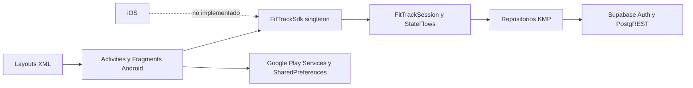
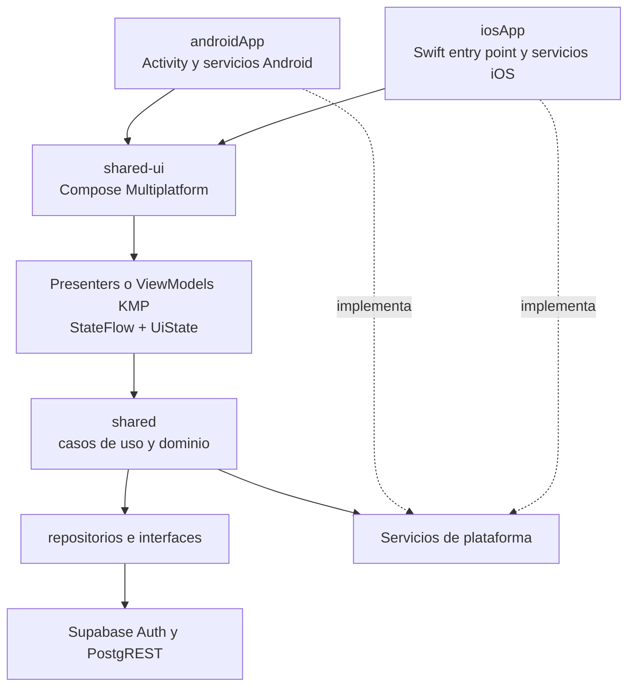
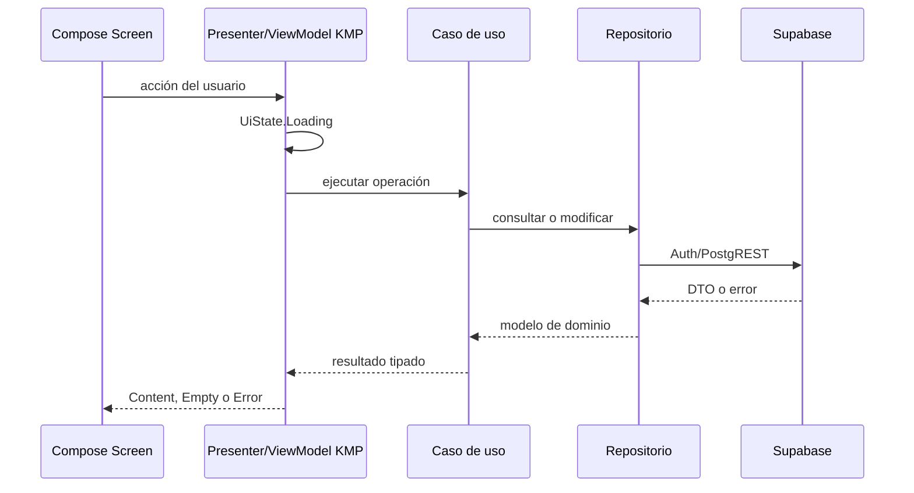
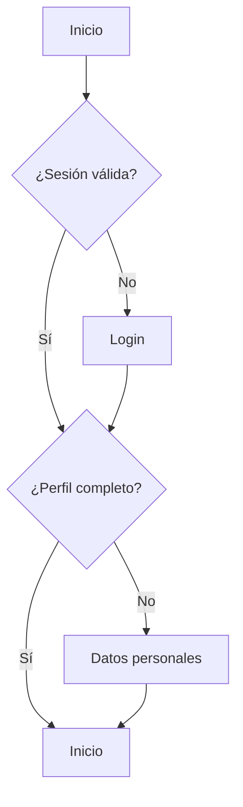
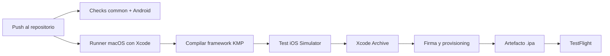

# Issue grande: migración total de FitTrack a Kotlin Multiplatform

## Resumen ejecutivo

FitTrack ya tiene una base Kotlin Multiplatform funcional: el módulo `shared`
contiene autenticación, sesión, acceso a Supabase, modelos, validaciones y
cálculos de dominio. Sin embargo, la aplicación todavía no es multiplataforma
de extremo a extremo porque toda la interfaz, navegación e integraciones de
usuario viven en Android Views/XML y no existe una aplicación iOS.

El objetivo de este issue es completar una aplicación con paridad funcional en
Android e iOS mediante:

- Kotlin Multiplatform para dominio, datos, estado y servicios compartidos.
- Compose Multiplatform para una única interfaz compartida.
- Entradas nativas delgadas para Android e iOS.
- Supabase como backend común.
- CI sobre macOS para compilar, firmar y distribuir la aplicación iOS sin
  necesitar una Mac local.

La migración se considerará terminada cuando Android e iOS implementen los
mismos recorridos funcionales, los builds de ambas plataformas se generen en
CI, exista una `.ipa` firmada instalable mediante TestFlight y la interfaz XML
anterior pueda retirarse sin perder funcionalidad.

## Estado actual confirmado

### Lo que ya funciona

- La rama de trabajo es `new-design`.
- `:shared:compileAndroidMain` compila correctamente.
- `:shared:testAndroidHostTest` pasa correctamente.
- `:app:compileDebugKotlin` compila correctamente.
- `:app` consume el módulo `:shared`.
- El dominio, los DTO, repositorios, validadores y la sesión están en
  `commonMain`.
- Supabase Auth y PostgREST se inicializan desde el módulo compartido.
- Hay implementaciones por plataforma para fecha y logging.
- Existen targets `iosArm64` e `iosSimulatorArm64`, pero solo se configuran al
  ejecutar Gradle en macOS.
- Android implementa login, registro, onboarding, inicio, rutinas, selector de
  ejercicios, entrenamiento, peso, calendario, perfil y logout.

### Brechas y bloqueadores

1. No existe `iosApp`, proyecto Xcode ni entrada Swift.
2. La UI continúa implementada con Activities, Fragments y XML de Android.
3. `RoutineDto` espera `routines.categoria`, pero la migración SQL no crea esa
   columna.
4. La migración no incluye datos iniciales para `exercises`; el selector puede
   quedar vacío.
5. La persistencia de sesión y preferencias no está abstraída para Android e
   iOS.
6. Google Sign-In está acoplado a Google Play Services.
7. Recuperación de contraseña, notificaciones, unidades, compartir y algunos
   ajustes continúan incompletos.
8. No hay tests de integración de repositorios ni pruebas UI completas.
9. No existe pipeline macOS para framework, simulador, archive o `.ipa`.
10. La app Android accede frecuentemente al singleton `FitTrackSdk.session`
    directamente desde la UI, dificultando pruebas y reutilización.

## Arquitectura

### Arquitectura actual



### Arquitectura objetivo



### Estructura objetivo

```text
FitTrack/
├── app/                 # Entrada Android delgada
├── shared/              # Dominio, datos, sesión y servicios KMP
├── shared-ui/           # Compose Multiplatform, navegación y presentación
├── iosApp/              # Proyecto Xcode y entrada Swift delgada
├── supabase/            # Migraciones y seeds versionados
└── .github/ o codemagic.yaml
```

No es necesario renombrar inmediatamente `shared` a `sharedLogic`; conservar el
nombre reduce riesgo sobre el trabajo existente. La separación importante es
que la nueva UI viva en `shared-ui` y que `app`/`iosApp` sean hosts.

## Interfaces y contratos compartidos

La UI no debe depender directamente de APIs Android ni del singleton global.
Se introducirán contratos inyectables equivalentes a los siguientes:

```kotlin
sealed interface AppRoute {
    data object Login : AppRoute
    data object Register : AppRoute
    data object PersonalData : AppRoute
    data object Home : AppRoute
    data object Routines : AppRoute
    data class RoutineDetail(val routineId: String) : AppRoute
    data class ActiveWorkout(val routineId: String) : AppRoute
    data object Weight : AppRoute
    data object Calendar : AppRoute
    data object Profile : AppRoute
}

sealed interface UiState<out T> {
    data object Loading : UiState<Nothing>
    data class Content<T>(val value: T) : UiState<T>
    data object Empty : UiState<Nothing>
    data class Error(val message: String, val retryable: Boolean) : UiState<Nothing>
}

interface SecureStorage {
    suspend fun read(key: String): String?
    suspend fun write(key: String, value: String)
    suspend fun remove(key: String)
    suspend fun clear()
}

interface OAuthProvider {
    suspend fun googleIdToken(): Result<String>
}

interface ShareService {
    suspend fun shareText(text: String): Result<Unit>
}

interface NotificationService {
    suspend fun requestPermission(): Boolean
    suspend fun scheduleWorkoutReminder(request: WorkoutReminder): Result<Unit>
    suspend fun cancelWorkoutReminder(id: String): Result<Unit>
}

interface DeepLinkHandler {
    val links: kotlinx.coroutines.flow.Flow<String>
}
```

También se definirá un contenedor `AppComponent` responsable de construir los
repositorios, casos de uso, sesión y servicios. Android e iOS entregarán sus
implementaciones nativas al iniciar la aplicación.

## Flujo de datos y navegación



La navegación compartida tendrá una única pila de `AppRoute`. El arranque
resolverá la ruta inicial así:



## Roadmap de implementación

### Fase 0 — Proteger y estabilizar la línea base

- Trabajar en una rama dedicada derivada de `new-design`.
- Separar cambios funcionales de cambios puramente visuales mediante commits
  pequeños y reversibles.
- Confirmar `assembleDebug`, tests de `shared` y smoke test Android.
- Documentar todas las pantallas y recorridos actuales antes de reemplazarlos.
- Incorporar capturas Android de referencia para verificar paridad visual.

**Salida:** baseline reproducible y sin cambios locales ambiguos.

### Fase 1 — Corregir backend y contratos

- Crear una migración nueva; no reescribir una migración ya aplicada.
- Añadir `categoria` a `routines` con valores permitidos:
  `tren_superior`, `tren_inferior`, `full_body` y `descanso`.
- Añadir seeds idempotentes del catálogo de ejercicios.
- Verificar índices, claves foráneas y RLS para perfiles, peso, rutinas,
  ejercicios asociados e historial.
- Definir un proyecto Supabase de staging para tests de integración.
- Eliminar fallbacks que oculten errores de esquema una vez estabilizado el
  backend; los errores remotos deben mostrarse como estados recuperables.

**Salida:** DTO, repositorios y base de datos usan el mismo contrato.

### Fase 2 — Preparar la arquitectura KMP

- Añadir `shared-ui` con Compose Multiplatform y Compose Compiler compatibles
  con las versiones de Kotlin y AGP elegidas.
- Configurar targets Android, `iosArm64` e `iosSimulatorArm64`.
- Mantener `iosX64` fuera salvo que se adopte un runner Intel.
- Extraer construcción de dependencias a `AppComponent`.
- Crear contratos para almacenamiento seguro, OAuth, compartir,
  notificaciones, deep links y configuración.
- Crear modelos `UiState`, eventos de una sola ejecución y rutas tipadas.
- Trasladar lógica de presentación desde Activities/Fragments a presenters o
  ViewModels en `commonMain`.

**Salida:** una pantalla Compose de prueba funciona en Android y simulador iOS.

### Fase 3 — Crear los hosts por plataforma

#### Android

- Convertir `MainActivity` en host de `App()`.
- Implementar almacenamiento seguro con Android Keystore o almacenamiento
  cifrado compatible.
- Mantener Google Sign-In nativo y entregar el ID token al flujo KMP.
- Implementar compartir, notificaciones y deep links con APIs Android.

#### iOS

- Crear `iosApp` y el proyecto Xcode versionado.
- Añadir una entrada Swift/SwiftUI mínima que aloje `ComposeUIViewController`.
- Implementar almacenamiento de sesión en Keychain.
- Implementar Google Sign-In iOS y entregar el ID token al flujo compartido.
- Implementar share sheet, notificaciones y Universal Links.
- Configurar iconos, launch screen, permisos, Bundle ID y URL schemes.

**Salida:** ambos hosts arrancan la misma UI y resuelven sus servicios nativos.

### Fase 4 — Migrar la UI por recorridos

Orden obligatorio para reducir dependencias y mantener la app utilizable:

1. Tema, tipografía, botones, inputs, tarjetas, loading y error.
2. Login, registro, recuperación de contraseña y onboarding.
3. Shell principal y navegación inferior.
4. Inicio, estadísticas, rachas y logros.
5. Rutinas, selector de ejercicios y detalle.
6. Entrenamiento activo, descansos y resumen.
7. Peso, historial y gráfica.
8. Calendario.
9. Perfil, unidades, tema, notificaciones, compartir y logout.

Cada recorrido debe alcanzar paridad funcional, visual y de accesibilidad en
Android e iOS antes de retirar su Activity, Fragment o XML equivalente.

**Salida:** toda la experiencia de usuario se ejecuta desde `shared-ui`.

### Fase 5 — Funcionalidad pendiente

- Recuperación real de contraseña mediante deep links/Universal Links.
- Edición, archivado o borrado de rutinas.
- Programación de rutinas por día, en lugar de usar siempre la primera rutina.
- Preferencia de kg/lb con conversión consistente en dominio y presentación.
- Recordatorios configurables.
- Compartir resumen de entrenamiento en ambas plataformas.
- Definir si `sensor_data` se implementará o se retirará del esquema; no debe
  quedar como funcionalidad ficticia.
- Persistir el detalle de series si se necesita historial de volumen real; en
  ese caso se añadirá una migración específica para sesiones y series.

**Salida:** ninguna opción visible queda como Toast o placeholder.

### Fase 6 — Retirar implementación Android anterior

- Eliminar navegación por `FragmentManager` después de validar Compose.
- Eliminar Activities/Fragments y layouts XML reemplazados.
- Retirar dependencias Android que ya no se utilicen.
- Mantener únicamente el host Android y adaptadores nativos.
- Ejecutar análisis de recursos y código no usados.

**Salida:** Android e iOS dependen de la misma UI y lógica compartidas.

## Estrategia de `.ipa` sin Mac local

No se puede producir una `.ipa` válida únicamente en Linux: la compilación iOS
requiere macOS y Xcode. La Mac puede ser un runner en la nube; no es obligatorio
tener hardware Apple local.

### Solución recomendada: Codemagic



Pasos:

1. Inscribirse en Apple Developer Program.
2. Crear el Bundle ID de FitTrack.
3. Crear el registro de la app en App Store Connect.
4. Crear una App Store Connect API Key para CI.
5. Conectar el repositorio a Codemagic.
6. Seleccionar una imagen macOS/Xcode compatible con el proyecto.
7. Configurar variables protegidas de Supabase y autenticación.
8. Configurar firma automática o cargar certificado `.p12` y provisioning
   profile.
9. Compilar `shared`/`shared-ui` para iOS.
10. Ejecutar tests de simulador.
11. Ejecutar `xcodebuild archive` y exportar la `.ipa`.
12. Guardar la `.ipa` como artefacto y subirla automáticamente a TestFlight.

Sin Apple Developer se podrá validar un build de simulador en CI, pero no crear
una `.ipa` firmada instalable ni distribuir mediante TestFlight.

## Alternativas visibles

### UI compartida

| Alternativa | Ventajas | Costes o límites | Decisión |
| --- | --- | --- | --- |
| Compose Multiplatform | Máximo código compartido y una sola UI | Migración completa desde XML | **Recomendada** |
| SwiftUI para iOS | Apariencia iOS muy nativa | Dos interfaces y mayor mantenimiento | Válida si se prioriza UX nativa |
| Mantener Android XML + SwiftUI | Menor cambio inmediato en Android | No completa una migración total de UI | Solo transición |

### Organización de módulos

| Alternativa | Ventajas | Costes o límites | Decisión |
| --- | --- | --- | --- |
| `shared` + `shared-ui` | Separación clara sin renombrar lo existente | Un módulo adicional | **Recomendada** |
| Un único módulo KMP | Configuración inicial menor | Mezcla UI, dominio y datos | No recomendada |
| `sharedLogic` + `sharedUI` | Nombres muy explícitos | Renombrado y diff innecesario | Posible más adelante |

### Servicio de CI iOS

| Alternativa | Ventajas | Costes o límites | Decisión |
| --- | --- | --- | --- |
| Codemagic | Flujo móvil, firma y TestFlight simplificados | Servicio externo y minutos macOS | **Recomendada** |
| GitHub Actions macOS | Integración natural con GitHub y control total | Firma y Xcode requieren más configuración | Primera alternativa |
| Xcode Cloud | Integración oficial de Apple | Configuración ligada a Apple/Xcode | Buena para equipos Apple |
| Bitrise | Plataforma móvil madura | Coste y otra integración externa | Alternativa comercial |

### Automatización UI

| Alternativa | Ventajas | Costes o límites | Decisión |
| --- | --- | --- | --- |
| Appium + UiAutomator2/XCUITest | Android e iOS con una estrategia común | Infraestructura y tests más lentos | **Recomendada para E2E** |
| Maestro | Casos YAML simples y rápidos | Menor control en escenarios complejos | Buena para smoke tests |
| Compose UI Test + XCTest | Integración nativa y diagnósticos precisos | Dos suites por plataforma | Recomendada por debajo del E2E |
| Playwright | Excelente para web/WebView | No cubre adecuadamente la UI nativa | No usar para FitTrack nativo |

### Navegación

| Alternativa | Ventajas | Costes o límites | Decisión |
| --- | --- | --- | --- |
| Rutas tipadas sobre estado | Poco acoplamiento y control total | Hay que mantener back stack y deep links | **Recomendada inicialmente** |
| Librería KMP de navegación | Más funciones listas | Compatibilidad y API externas | Evaluar tras el primer flujo |
| Navegación separada por plataforma | Muy nativa | Duplica rutas y coordinación | No recomendada para UI compartida |

## Pruebas

### Pirámide de pruebas

- `commonTest`: validaciones, estadísticas, rachas, logros, casos de uso,
  reducers/presenters y reglas de navegación.
- Tests de repositorios: DTO, serialización, errores HTTP, expiración de sesión,
  reintentos y Supabase staging.
- Tests Compose compartidos: renderizado de estados, formularios, validaciones
  y navegación.
- Android: tests de integración Compose y smoke tests Appium/UiAutomator2.
- iOS: tests de simulador/XCTest y smoke tests Appium con XCUITest en macOS.

### Escenarios obligatorios

1. Registro y confirmación de email.
2. Login email y Google.
3. Recuperación de contraseña por enlace.
4. Onboarding y edición de datos personales.
5. Crear, editar y eliminar/archivar una rutina.
6. Seleccionar ejercicios y conservar orden, series, repeticiones y descanso.
7. Completar entrenamiento y comprobar duración, volumen, racha y logros.
8. Registrar y editar peso en kg y lb.
9. Consultar calendario y estadísticas.
10. Configurar recordatorios y recibir una notificación.
11. Compartir un resumen.
12. Cerrar sesión y eliminar datos sensibles locales.
13. Recuperarse de falta de red, token expirado y respuesta inválida.

## CI y controles de calidad

Cada pull request ejecutará:

- Compilación y tests de `shared`.
- Compilación y tests de `shared-ui`.
- Android lint, tests y APK debug.
- Compilación de framework y app para simulador iOS en runner macOS.
- Validación de migraciones contra Supabase de staging.
- Detección de secretos y revisión de dependencias.

Las ramas de release agregarán:

- Android AAB firmado.
- Archive iOS firmado y `.ipa`.
- Publicación interna en Play Console y TestFlight.
- Artefactos, logs, reportes de tests y capturas de smoke tests.

## Definición de completado

- [ ] Android e iOS muestran la misma experiencia y funcionalidades.
- [ ] Toda la UI funcional está en Compose Multiplatform.
- [ ] Los hosts nativos contienen solo inicialización y servicios de plataforma.
- [ ] No quedan pantallas XML/Fragments activas.
- [ ] Supabase, DTO, seeds y RLS son consistentes.
- [ ] Sesión y preferencias usan almacenamiento seguro en ambas plataformas.
- [ ] Google Sign-In y recuperación de contraseña funcionan en ambas plataformas.
- [ ] No quedan acciones visibles implementadas como placeholders.
- [ ] Todos los escenarios obligatorios pasan en CI.
- [ ] CI genera APK/AAB y build de simulador iOS.
- [ ] CI genera una `.ipa` firmada.
- [ ] La `.ipa` se instala y valida mediante TestFlight.
- [ ] Existe documentación de configuración, release y recuperación ante fallos.

## Riesgos principales

- Compatibilidad entre Kotlin, AGP, Compose Multiplatform, Ktor y Supabase.
- Diferencias de ciclo de vida y navegación entre Android e iOS.
- OAuth, deep links, Keychain y firma iOS requieren configuración externa.
- Migrar toda la UI de una vez elevaría el riesgo; debe hacerse por recorridos.
- Los fallbacks en memoria pueden esconder fallos remotos y producir diferencias
  entre dispositivos.
- No disponer de Apple Developer bloquea distribución, aunque no el desarrollo
  inicial ni los builds de simulador.

## Referencias

- [Estructura recomendada para proyectos Kotlin Multiplatform](https://kotlinlang.org/docs/multiplatform/multiplatform-project-recommended-structure.html)
- [Introducción oficial a Kotlin Multiplatform](https://kotlinlang.org/docs/multiplatform/quickstart.html)
- [Cliente Kotlin de Supabase](https://supabase.com/docs/reference/kotlin/introduction)
- [Firma y distribución iOS con Codemagic](https://docs.codemagic.io/yaml-code-signing/signing-ios/)
- [Runners macOS de GitHub Actions](https://docs.github.com/en/actions/reference/runners/github-hosted-runners)
- [Xcode Cloud](https://developer.apple.com/documentation/xcode/xcode-cloud)
- [Appium](https://appium.io/)
