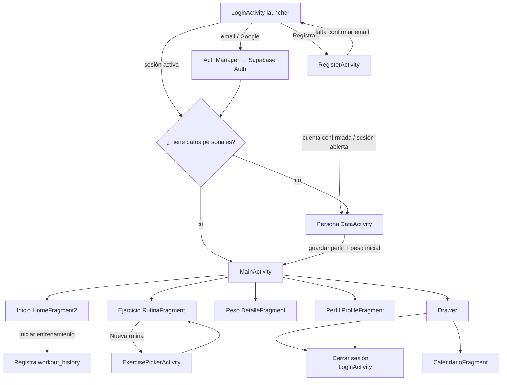

# FitTrack

App Android de seguimiento de entrenamiento y peso. El usuario se autentica, registra sus datos personales, crea rutinas con ejercicios del catálogo, marca entrenamientos completados y consulta el progreso semanal y mensual.

La interfaz actual es **Android Views (XML + Material 3)**. La lógica de dominio, autenticación y acceso a datos vive en un módulo **Kotlin Multiplatform** (`:shared`) para poder reutilizarla más adelante en iOS. Hoy **no hay UI de iOS**: el target iOS del módulo shared solo se genera en macOS.

---

## Stack

| Capa | Tecnología |
| --- | --- |
| UI Android | Activities / Fragments, XML, Material 3, Drawer + BottomNavigation |
| Lógica compartida | Kotlin Multiplatform (`commonMain`) |
| Backend | Supabase (Auth + PostgREST) |
| HTTP | Ktor 2.3 + supabase-kt 2.0 (`gotrue-kt`, `postgrest-kt`) |
| Build | Gradle 9.1, AGP 9.0, Kotlin 2.2.10 |
| SDK Android | minSdk 21, compileSdk / targetSdk 34 |

No usa Jetpack Compose ni Navigation Component. La navegación es `FragmentManager.replace()` más `BottomNavigationView` y `NavigationView`. `lifecycle-viewmodel-ktx` está declarado pero no se usa: el estado vive en `FitTrackSdk.session` (StateFlows).

---

## Módulos

```
FitTrack/
├── app/          # UI Android (XML + Kotlin)
├── shared/       # KMP: auth, repos, dominio, sesión
└── supabase/     # Migración SQL canónica
```

- **`:app`** — pantallas, layouts, Google Sign-In y observación de `FitTrackSdk.session`.
- **`:shared`** — `FitTrackSdk`, `AuthManager`, repositorios PostgREST, validadores y cálculos de estadísticas.
- **`supabase/migrations/20260812174000_fittrack_kmp.sql`** — esquema de tablas, índices, triggers y RLS.

Al arrancar, `FitTrackApp` llama a `FitTrackSdk.initialize()` con `BuildConfig.SUPABASE_URL` y `BuildConfig.SUPABASE_ANON_KEY` (leídos de `local.properties`).

---

## Flujo actual

Este es el recorrido que implementa el código hoy.



### 1. Arranque y autenticación

`LoginActivity` es el launcher. Si ya hay usuario en Supabase Auth, no muestra el formulario: llama a `FitTrackSdk.onAuthenticated()` y decide el destino.

| Destino | Condición |
| --- | --- |
| `MainActivity` | El perfil tiene estatura, meta de peso, fecha de nacimiento y género (`hasPersonalData`) |
| `PersonalDataActivity` | Falta alguno de esos campos |

Entrada de sesión:

- **Email + contraseña** — validación local (`AuthValidator`) y `AuthManager.signIn()`.
- **Google** — `GoogleSignInHelper` pide un ID token y `AuthManager.signInWithGoogle()`. Si Google no entrega token, **no** se entra a la app.
- **Registro** — nombre, email, contraseña fuerte (mayúscula + número), confirmación y términos. Si Supabase deja la sesión abierta, va a datos personales; si pide confirmar el email, vuelve al login.

“Olvidé mi contraseña” solo muestra un Toast. `AuthManager.resetPassword()` existe en shared pero no está conectado a la UI.

### 2. Onboarding de datos personales

`PersonalDataActivity` pide:

- Fecha de nacimiento
- Género (`masculino`, `femenino`, `otro`, `prefiero_no_decir`)
- Estatura (cm)
- Peso actual (kg)
- Meta de peso (kg)

Al guardar, `FitTrackSession.savePersonalData()` actualiza `profiles` y crea el primer registro en `weight_records`. Después abre `MainActivity` y limpia el back stack.

### 3. Shell principal

`MainActivity` monta:

- Toolbar + Navigation Drawer
- `BottomNavigationView` con cuatro pestañas
- Contenedor `frame_layout` para fragments

Pestaña inicial: **Inicio**.

| Bottom nav | Fragment | Qué hace |
| --- | --- | --- |
| Inicio | `HomeFragment2` | Saludo, progreso semanal y botón para registrar el entrenamiento de la primera rutina |
| Ejercicio | `RutinaFragment` | Crear / listar rutinas e historial de entrenamientos |
| Peso | `DetalleFragment` | Peso actual, meta y últimos 4 registros (alta y edición) |
| Perfil | `ProfileFragment` | Nombre, estadísticas y cierre de sesión |

El drawer añade Calendario, atajos a Inicio/Perfil, y logout real (`FitTrackSdk.signOut()`). Compartir y “Acerca de” son Toasts.

### 4. Inicio

Observa perfil, rutinas y workouts:

- Saludo con el nombre del perfil (o “Atleta”).
- Completados esta semana vs meta semanal (suma de `weeklyFrequency` de las rutinas).
- Tarjeta de “hoy”: **la primera rutina de la lista**, no un calendario de días.
- **Iniciar entrenamiento** llama a `completeWorkout()` y guarda una fila en `workout_history`. No hay temporizador ni pantalla de series/reps en vivo: es un registro inmediato.

Sin rutinas, el botón queda deshabilitado.

### 5. Rutinas y ejercicios

Dos pestañas:

1. **Mis rutinas** — listado; vacío invita a crear la primera. El botón **Nueva rutina** abre el formulario (nombre, duración, categoría, frecuencia semanal y selector de ejercicios).
2. **Historial** — entrenamientos registrados desde Inicio.

Categorías: Tren superior, Tren inferior, Full body, Descanso.

Al pulsar una rutina se abre `RoutineDetailDialogFragment` con series/reps (por defecto 3×10).

`ExercisePickerActivity` agrupa el catálogo de `exercises` por grupo muscular. Hay que elegir al menos un ejercicio. Ese catálogo es **solo lectura** desde Supabase: si la tabla está vacía o falla la red, el selector no inventa ejercicios (un id falso rompería `routine_exercises`).

### 6. Peso

- Muestra el último peso y la meta del perfil.
- “Registrar peso hoy” inserta un registro.
- Cada uno de los 4 slots visibles se puede editar.
- Validación: 1–300 kg.

### 7. Perfil

- Nombre, “miembro desde” (mes actual del dispositivo, no `created_at` del perfil).
- Total de entrenamientos y horas activas salen del historial en sesión.
- Racha aún no se calcula de verdad.
- Meta/datos, unidades y notificaciones son Toasts.
- **Cerrar sesión** sí llama a `FitTrackSdk.signOut()` y vuelve al login (igual que el drawer).

### 8. Calendario (solo drawer)

- Mes con días coloreados si hubo entrenamiento (color según categoría).
- Detalle del día seleccionado; toque abre el diálogo de la rutina.
- “Próximas rutinas” lista las rutinas guardadas (no un schedule por fecha).
- Resumen del mes: horas totales, tren superior, tren inferior y horas de descanso (`días sin entrenar × 24`).

---

## Datos y sesión

Tras autenticarse, `FitTrackSdk.onAuthenticated()` ejecuta `FitTrackSession.start()` y carga:

| StateFlow | Origen |
| --- | --- |
| `profile` | `profiles` |
| `weightRecords` | `weight_records` |
| `routines` | `routines` |
| `workouts` | `workout_history` |
| `exercises` | `exercises` (catálogo global) |

Los repositorios de rutinas, peso e historial, si PostgREST falla, **caen a una caché en memoria** (las rutinas incluso siembran 4 ejemplos). Al cerrar sesión se limpia esa caché.

Tablas del esquema:

`profiles`, `exercises`, `routines`, `routine_exercises`, `weight_records`, `workout_history`, `sensor_data`

Hay RLS (el usuario solo ve lo suyo; el catálogo de ejercicios es legible para `authenticated`), índices y un trigger que crea `profiles` al registrarse en `auth.users`.

`sensor_data` está en SQL pero **no hay UI ni repositorio** que la use.

### Desajuste actual esquema ↔ app

`RoutineDto` exige la columna `categoria`, pero la migración `20260812174000_fittrack_kmp.sql` **no crea esa columna** en `routines`. Listar o crear rutinas contra ese esquema falla y la app usa la caché local. Hay que añadir `categoria` en una migración (valores: `tren_superior`, `tren_inferior`, `full_body`, `descanso`) para que el flujo remoto coincida con la UI.

El catálogo `exercises` tampoco trae seeds en la migración: sin datos cargados a mano en Supabase, el selector de ejercicios queda vacío.

---

## Cómo ejecutarlo

1. Android Studio (o SDK + JDK 11). En Linux, Gradle suele ir mejor con el JBR de Android Studio:

   ```bash
   export JAVA_HOME="/path/to/android-studio/jbr"
   ```

2. Copia `local.properties.example` a `local.properties` y rellena:

   ```
   sdk.dir=/ruta/al/android/sdk
   SUPABASE_URL=https://TU_PROYECTO.supabase.co
   SUPABASE_ANON_KEY=tu-anon-key
   ```

3. Aplica la migración en el proyecto de Supabase (`supabase/migrations/20260812174000_fittrack_kmp.sql`) y carga ejercicios en `public.exercises`.

4. Google Sign-In: Web Client ID en `GoogleSignInHelper`, SHA-1 de debug en Google Cloud / Firebase, y provider Google habilitado en Supabase Auth.

5. Compilar / instalar:

   ```bash
   ./gradlew :shared:compileAndroidMain
   ./gradlew :shared:testAndroidHostTest
   ./gradlew :app:compileDebugKotlin
   ./gradlew :app:installDebug
   ```

En Windows existe `verificar_app.bat` (`clean` + `assembleDebug` + tests del módulo app).

---

## Tests

En `:shared` (commonTest):

- `AuthValidatorTest`
- `FitnessValidatorTest`
- `WorkoutStatsTest`
- `CalendarStatsTest`

Cubren validación de formularios y cálculos de semana/calendario, no la UI ni PostgREST.

---

## Qué está hecho y qué no

**Hecho**

- Login email, Google y registro
- Gate de onboarding según perfil
- Sesión KMP observada por la UI
- CRUD de peso (alta/edición de los últimos 4)
- Alta de rutinas con ejercicios del catálogo
- Registro de entrenamientos y historial
- Calendario mensual y resumen por categoría
- Logout real (perfil y drawer)

**Pendiente o a medias**

- Recuperación de contraseña
- Pantalla de entrenamiento en vivo (series, descanso, sensores)
- Edición/borrado de rutinas
- Programación real por día (Inicio usa la primera rutina)
- Ajustes de perfil (meta, unidades, notificaciones)
- Compartir / About
- Cliente iOS
- Columna `categoria` y seed de `exercises` en SQL
- Uso de `sensor_data`
